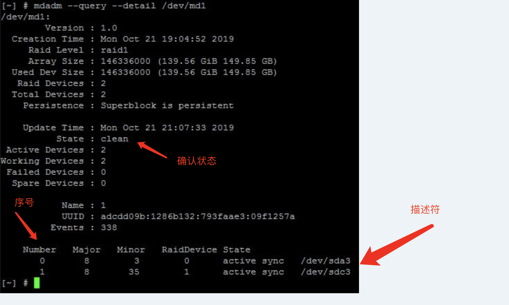
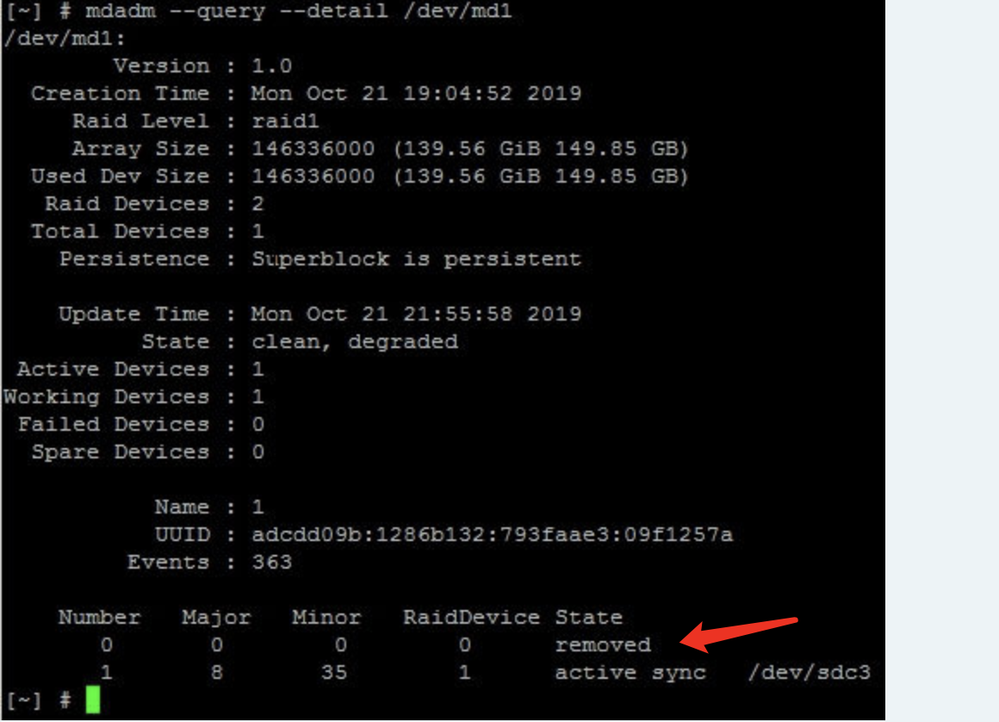

## 背景

这个NAS当初买回来的时候还比较青涩，配了一个4T的盘并且没有做好规划。当时只是认定了要使用静态卷来存储，不使用各种Raid，没有仔细考虑过如果4T的盘满了，要如何进行扩容。

事实上一旦开始囤电影电视剧，这块4T的盘很快就满了。威联通是有系统盘一说的，虽然可以选则APP装在哪个盘上，但像我这种情况，肯定都是装在4T的盘上的，所以盘中除了资料之外，还有整个NAS的配置，各种Docker、虚拟机等等，甚至家里的主路由都跑在这台NAS上。

为了避免把这么多东西都重新配置一遍，我想做到无痛扩容，本来以为会有类似TimeMachine迁移的方法，直接把新硬盘插上，直接迁移就可以，结果发现并没有…官方的扩容方法只能是通过组Raid来进行扩容，并且官方没有把Raid转为静态卷的方法。不得已只能冒着损失资料的风险自己折腾了。<!--more-->

## PS

折腾过程参考<https://forum.qnap.com/viewtopic.php?t=150513>

本人按此方法成功进行了扩容，但并不保证一定成功，如果要按此方法进行扩容，请做好备份和损失数据的心理准备

请先大致理解全部流程，修改参数时知道自己在做什么，不建议完全不熟悉linux的新手进行尝试

过程以文字描述，因为我使用的是英文界面，所以提到对应功能时会用英文名称。折腾过程中没有保存图片，所以就不配图了，如果找不到对应的功能，可以参考上面的原始资料

我的QTS版本是4.4.1.1216

## 过程

1. 开始之前，保存一份`/etc/config/raid.conf`的内容，内容如下

    ```shell
    [Global]
    raidBitmap = 0x2
    pd_50014EE2114D436B_Raid_Bitmap = 0x2 # 对应原硬盘编号

    [RAID_1]
    uuid = d6fef666:b7934ec0:f227970c:1ce71ae7
    id = 1
    partNo = 3
    aggreMember = no
    readonly = no
    legacy = no
    version2 = yes
    overProvisioning = 0
    deviceName = /dev/md1
    raidLevel = 1
    internal = 1
    mdBitmap = 0
    chunkSize = 0
    readAhead = 0
    stripeCacheSize = 0
    speedLimitMax = 0
    speedLimitMin = 0
    dataBitmap = 1
    data_0 = 1, 50014EE2114D436B # 对应原硬盘编号，data_0表示在Raid组中此硬盘序号是0，1表示插在NAS的1号插槽内
    ```
    
2. 插入新硬盘，在管理界面中，使用`migrate`功能创建一个`Raid1`，创建的时候选新插的那块硬盘

3. 这时NAS会开始在新旧硬盘之间同步数据，我们要做的就是等待同步完成

4. 一旦同步完成之后，`/etc/config/raid.conf`的内容会发生变化
    ```shell
    [Global]
    raidBitmap = 0x2
    pd_50014EE2114D436B_Raid_Bitmap = 0x2 # 旧硬盘
    pd_5000CCA291E680A8_Raid_Bitmap = 0x2 # 新硬盘

    [Remove]

    [RAID_1]
    uuid = d6fef666:b7934ec0:f227970c:1ce71ae7
    id = 1
    partNo = 3
    aggreMember = no
    readonly = no
    legacy = no
    version2 = yes
    overProvisioning = 0
    deviceName = /dev/md1
    raidLevel = 1
    internal = 1
    mdBitmap = 0
    chunkSize = 0
    readAhead = 4096 // 0 -> 4096
    stripeCacheSize = 0
    speedLimitMax = 0
    speedLimitMin = 0
    data_0 = 1, 50014EE2114D436B # 旧硬盘，Raid内序号0，插在1号插槽
    data_1 = 2, 5000CCA291E680A8 # 新硬盘，Raid内序号1，插在2号插槽
    dataBitmap = 3 // 1 -> 3
    # 以下是新出现的相关配置项
    scrubStatus = 1
    eventSkipped = 0
    eventCompleted = 1
    degradedCnt = 0
    ```
    
5. 运行`mdadm --query --detail /dev/md1`可以查看当前卷的情况，这里参考原始资料中的图就好

    

    这里要仔细，图中的序号，就是之前在配置文件中提到的序号，它跟硬盘是对应的，接下来的操作一定不要直接照抄，确保理解了以后再操作。

    我的目的是替换掉旧硬盘，即上面配置文件中的`data_0 = 1, 50014EE2114D436B`，可以看到，序号是``，所以按照上图（不是我的实际截图，注意理解思路），我应该关注的就是`/dev/sda3`

6. 执行
    ```shell
    mdadm /dev/md1 --fail /dev/sda3
    mdadm /dev/md1 --remove /dev/sda3
    ```

    注意这里的`/dev/sda3`来自上一步，不可随便照搬。大概意思是把对应的硬盘设为`fail`状态，执行之后，NAS会报警，表示硬盘被移除了

    再次运行`mdadm --query --detail /dev/md1`可以对应磁盘的状态变为`removed`，在NAS管理页面也应该可以看到磁盘被移除了

    

7. 执行
    ```shell
    mdadm --grow /dev/md1 --raid-devices=1 --force
    ```
    意思是，把raid中的磁盘数量减少为1

8. 编辑`/etc/config/raid.conf`文件，让配置文件回到没有组建Raid1之前的状态，但对应的是我们替换过的新硬盘，修改过的内容是这样

    ```shell
    [Global]
    raidBitmap = 0x2
    pd_5000CCA291E680A8_Raid_Bitmap = 0x2 # 对应新硬盘
    
    [RAID_1]
    uuid = d6fef666:b7934ec0:f227970c:1ce71ae7
    id = 1
    partNo = 3
    aggreMember = no
    readonly = no
    legacy = no
    version2 = yes
    overProvisioning = 0
    deviceName = /dev/md1
    raidLevel = 1
    internal = 1
    mdBitmap = 0
    chunkSize = 0
    readAhead = 0 # 4096 -> 0
    stripeCacheSize = 0
    speedLimitMax = 0
    speedLimitMin = 0
    dataBitmap = 1 # 3 -> 1
    data_0 = 1, 5000CCA291E680A8 # 这里是新硬盘的编号，注意我写的是“data_0 = 1, XXXX”，这是因为这块硬盘应该是Raid中序号为0的盘，而我之后会把它插在插槽1中
    ```

9. 执行

    ```shell
    halt
    ```
    把NAS完全关机，或者从Web界面关机都可以

10. 等完全关机之后，把新硬盘插到插槽1（注意跟修改过的`/etc/config/raid.conf`内容要对应）中，旧硬盘插到插槽2中，开机

    按照原始资料，到这里就结束了，但我遇到了扩展后的静态卷容量不对的问题（从4T的盘换成12T的，但静态卷的容量依然是4T）。如果你也遇到同样的问题，接着往下看

11. 执行
     ```shell
     mdadm --grow /dev/md1 --size=max
     ```

     对raid组进行扩容，使用尽可能大的空间，执行后容量正常

12. 旧的硬盘可能会无法立刻使用，进行扫描和格式化之后即可正常使用

## 心得

中文互联网没有相关资料，甚至讨论深入一点的资料也没有…从威联通客服那也没得到可行的方案，参考的原始资料原文是西班牙文，被翻译成英文。

再次感叹学英语的重要性，毕竟一份资料被翻译成英文的概率远远大于被翻译成中文的概率。

另外，扩容完成之后，我觉得提前做好规划，是可以避免遇到这种情况的。比如不用扩容旧的4T硬盘，而是重新规划硬盘的作用，老的4T硬盘就用来下载及安装系统应用，下载成功后移到其他硬盘保存，Plex等挂载新硬盘的目录。虽然不算完全的无痛迁移，但不用提心吊胆的走人家没走过的路，不用冒损失资料的危险。

选择有时要比努力更重要…