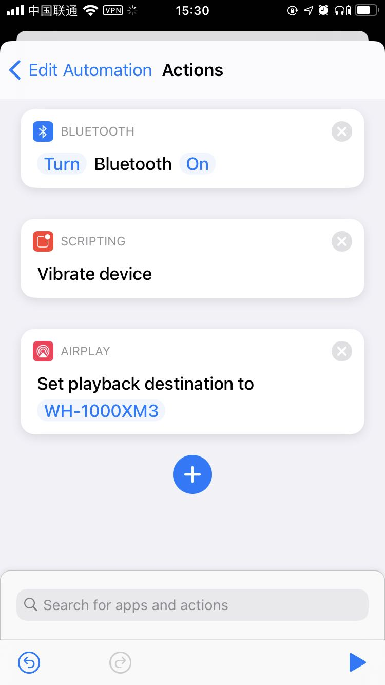

WH-1000X M3跟安卓手机配合是很好的，比如我的小米8，只要非锁屏状态下靠近NFC区域，就可以自动连接耳机。自从变成双机党（还有一台iPhone SE2）之后，多设备切换就成了问题，在发现本文的方法之前，最快的方式是

1. 安卓打开蓝牙菜单，点WH-1000X M3断开当前连接
2. ios打开蓝牙菜单，点WH-1000X M3连接

或者是直接长按电源关闭WH-1000X M3，再长按进入配对模式，直接在ios上连接。

显然看上去就非常麻烦…

然后我看到了这篇文章：[利用快捷指令连接Sony耳机](https://sspai.com/post/56974)，受到了启发，原来shortcut还能这么玩呢？但是文章中提到的shortcut，逻辑是检测到NFC之后，打开蓝牙菜单，然后还是要手动连接。这显然还是很麻烦，跟安卓的体验依然差着一大截。

总之，经过摸索，ios是可以实现直接扫描NFC连接到耳机的，全程不用手动确认之类的操作。

完整的脚本就是上面这个样子了，需要注意的是`Set playback destination to`这一步在设置时，需要耳机已经连接到手机了，不然你是找不到对应的设备的。

至此，ios的体验跟安卓已经不相上下了，甚至更胜一筹（安卓连接手机不会震动），美中不足的是连接时会报找不到设备的错误，不过实际上不影响使用。