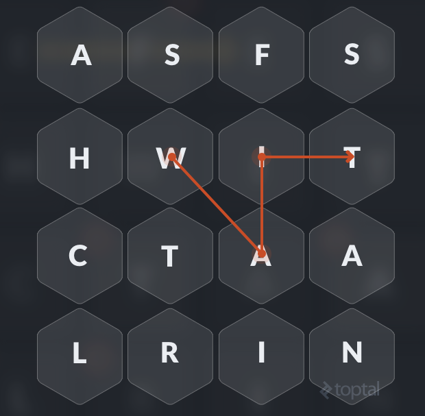
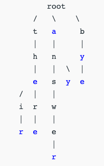

## 解决什么问题

我们有如下需求，给出`4*4`的字母表，我们可以通过把相邻（横向、竖向、斜向都算相邻）的字母连接起来组成一个单词，要找到所有单词。像下图画的`WAIT`就算是一个单词。假设我们已经有所有单词的词库。

容易想到的方法是我们可以从左上角`[0,0]`开始，用`DFS`的方法进行搜索；之后再从`[0,1]`开始，以此类推。因为`DFS`过程中，每新增一个字母，我们都要去跟词库做一次比较，所以词库如何实现对程序的运行效率有很大的影响。



需要一个快速查找有没有某元素的数据结构，我们容易想到哈希表，但是在这个需求里，哈希表不能满足需求。就像上面`WAIT`的例子，搜索的时候应该是`W -> WA -> WAI -> WAIT`这样，如果词库使用哈希表实现，只能告诉我们`WAIT`存在，我们的程序依然要处理**所有的序列**，因为词库不能告诉我们`W`开头有没有单词，甚至`WAIT`之后还有没有单词。所以在找到`WAIT`之后，搜索也不能停下来，否则就可能漏掉正确答案。

如果词库在搜W的时候告诉我们没有搜下去的必要了，那么我们就可以放弃继续搜索，转而搜索其他序列，大大提高效率。

所以我们需要的词库应该满足下面的需求

1. 快速查询一个字符序列是不是一个单词
2. 快速查询还有没有其他以此字符序列开头的更长的单词了
3. 为节省空间，希望每个单词只存储一份

写成程序，我们的词库接口应该是这个样子

```java
public interface Vocabulary {
    boolean add(String word);
    boolean isPrefix(String prefix);
    boolean contains(String word);
}
```

## 什么是字典树（Trie）

字典树就是一种可以满足以上需求的数据结构。顾名思义，字典树是多叉树，每个节点存储了下一个字符的集合，以及此结点是不是一个单词的结尾



其中上图中，蓝色的结点就是单词的结尾。

如果我们查到这个节点，发现它是单词的结尾，就说明目前的字符序列对应了一个单词；如果此结点还有子结点，说明存在以此字符序列开头的更长的单词，可以继续往下搜索。

添加单词时也一样，查询时碰到不存在的结点就添加，在达到末尾时标记结点为单词的结尾。

比较完整的实现可以参考[这里](https://algs4.cs.princeton.edu/code/edu/princeton/cs/algs4/TrieSET.java.html)

## 对比其他数据结构

要实现上面的需求，并不一定只能用字典树，但是字典树是其中最好的一种方案。

比如我们要实现`contains(String word)`方法，就要求快速确定某元素是否存在；实现`isPrefix(String prefix)`其实是快速找到下一个比`prefix`元素“大”的元素，所以需要一个“有序”的数据结构。

比如我们可以用`ArrayList`实现，`contains(String word)`和`isPrefix(String prefix)`可以通过二分查找来做，`add(String word)`之后要对列表再进行排序，保持整体有序。其中两个搜索操作都是*O(log(n))*的复杂度。

再比如我们可以用二叉树来实现。搜索也是*O(log(n))*的复杂度。

